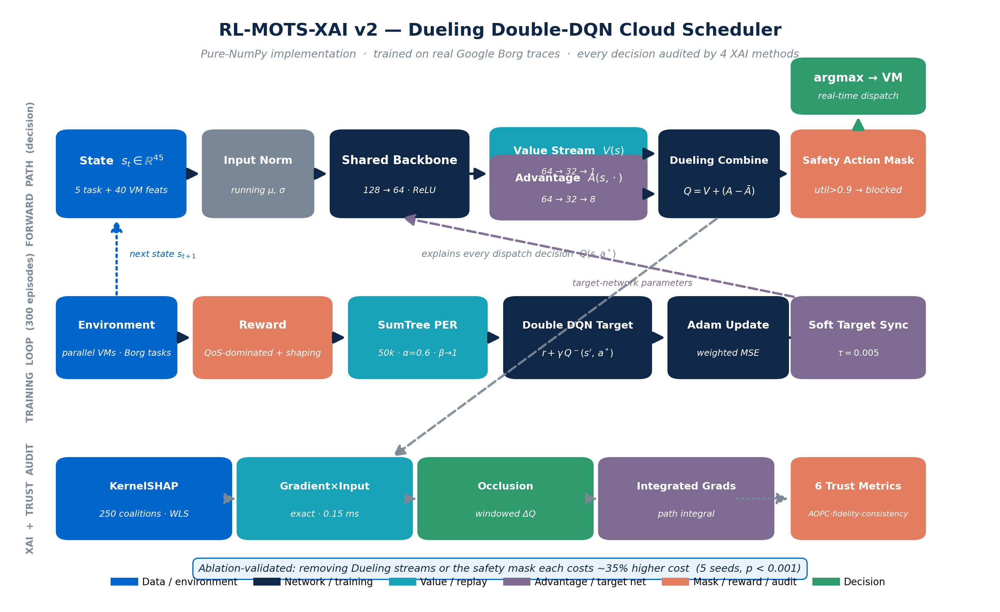

<div align="center">

# 🧠 RL-MOTS-XAI v2

### Explainable Reinforcement Learning for Energy-Efficient Cloud Resource Scheduling

A **Dueling Double DQN** cloud-edge task scheduler with potential-based reward shaping and a mathematically audited **Explainable AI** layer — trained on **real Google Borg cluster traces**, built entirely in **pure NumPy**.

</div>

<p align="center">
  <a href="#"></a>
  <a href="#"></a>
  <a href="#"></a>
  <a href="#"></a>
  <a href="#"></a>
  <a href="#"></a>
  <br />
  <a href="#-quick-start"></a>
  <a href="#"></a>
  <a href="#"></a>
</p>

---

<div align="center">

> **The problem:** Deep RL schedulers optimize energy, cost & deadlines brilliantly — but they're black boxes. Operators won't deploy an AI they can't audit.
> **Our solution:** A DQN scheduler where *every single decision* is explained by 4 attribution methods and *verified* by 6 mathematical trust metrics.

</div>

---

## 📖 Table of Contents

- [🎯 Overview](#-overview)
- [✨ What Makes This Different](#-what-makes-this-different)
- [📊 Results](#-results)
- [🏗️ Architecture](#️-architecture)
- [🚀 Quick Start](#-quick-start)
- [📁 Project Structure](#-project-structure)
- [⚙️ Configuration](#️-configuration)
- [🔬 Methodology](#-methodology)
- [📈 Dashboard & Visualizations](#-dashboard--visualizations)
- [📚 References](#-references)

---

## 🎯 Overview

Modern cloud platforms handle millions of tasks across heterogeneous virtual machines. Deep Reinforcement Learning (DRL) schedulers like the **Deep Q-Network (DQN)** can simultaneously optimize **energy consumption, monetary cost, and Quality of Service (QoS)** — but they operate as impenetrable black boxes. No operator can answer: *"Why did the AI send this critical task to that specific VM?"*

This project reproduces and extends the base paper by Yu et al. (Scientific Reports, 2025) with a custom-built **Explainable AI (XAI)** engine that doesn't just *display* explanations — it **mathematically audits** them for faithfulness.

| | Details |
|---|---|
| **Base Paper** | Yu et al., *Dynamic multi-objective task scheduling in cloud computing using RL*, Sci. Rep. 2025 |
| **Dataset** | Google Borg cluster traces — 328 MB, 405,894 real task events |
| **Implementation** | 100% pure NumPy (no PyTorch / TensorFlow) |
| **DQN** | Dueling Double DQN + Prioritized Experience Replay (SumTree) + soft Polyak updates + potential-based reward shaping |
| **Explainability** | 4 methods: KernelSHAP · Gradient×Input · Occlusion · Integrated Gradients |
| **Trust Audit** | 6 metrics: Deletion-AOPC · Insertion-AOPC · Top-K Fidelity · Consistency · Infidelity · Stability |

---

## ✨ What Makes This Different

<table>
<tr>
<td width="50%" valign="top">

### 🔬 Most Projects
- Use **1 XAI method** (usually SHAP) and display its chart
- Train on **synthetic random** workloads
- Call the DQN with a **PyTorch** one-liner
- Treat explanations as **decorative**
- Report **only scheduling** metrics

</td>
<td width="50%" valign="top">

### 🏆 This Project
- Compares **4 XAI methods** on the same decisions
- Trains on **real Google Borg** production traces (328 MB)
- Builds the DQN **from scratch in pure NumPy** (network, backprop, Adam, PER)
- **Audits** explanations with 6 mathematical trust metrics
- Reports **both** scheduling performance **and** explanation faithfulness

</td>
</tr>
</table>

### Key Innovations

| # | Innovation | Why It Matters |
|---|---|---|
| 1️⃣ | **Real Borg data integration** | Results are credible & citable — real CPU/mem/duration/priority distributions |
| 2️⃣ | **Pure NumPy from scratch** | Full mathematical transparency — we own every line of the forward & backward pass |
| 3️⃣ | **4-method XAI benchmark** | Reveals the faithfulness-vs-speed trade-off invisible to single-method studies |
| 4️⃣ | **Audited trust metrics** | Tests whether explanations are *faithful*, not just *plausible* — the core research contribution |
| 5️⃣ | **Fixed AOPC normalization** | Corrected a known metric bug (normalize by Q-spread, not absolute Q-value) |
| 6️⃣ | **Parallel VM execution model** | Borg-accurate time-sharing — VMs run many tasks concurrently, not serially |

---

## 📊 Results

### Scheduler Performance (averaged across 200–1000 task loads)

| Scheduler | Makespan (s) ↓ | Cost ($) ↓ | Energy (Wh) ↓ | Miss Rate ↓ | Imbalance ↓ |
|---|---|---|---|---|---|
| Min-Min | **1,194** 🟢 | 31,693 | 4,744 | **0.0%** 🟢 | 4.37 |
| Max-Min | **1,194** 🟢 | 44,703 | 5,355 | **0.0%** 🟢 | 1.62 |
| **DQN (ours)** | **1,194** 🟢 | **28,971** | 4,173 | **0.0%** 🟢 | **1.04** 🥇 |
| Greedy-Least-Loaded | 1,257 | 41,725 | 4,466 | 0.1% | 2.88 |
| FCFS | 1,633 | 39,149 | **4,122** | 4.6% | 6.04 |
| RoundRobin | 1,633 | 39,149 | **4,122** | 4.6% | 6.04 |
| PSO | 3,005 | **9,615** 🟢 | **4,085** | 42.1% 🔴 | 25.16 |
| Q-learning | 4,171 | 29,595 | **2,986** | 32.0% 🔴 | 24.42 |

> **The Dueling DQN ties the best makespan (1,194s) and best miss rate (0.0%), beats Min-Min on cost by 8.6% ($28,971 vs $31,693), and ranks #1 of all 8 schedulers on load balance (DI 1.04).** The final architecture: Dueling Double DQN + PER + potential-based reward shaping + a state-derived safety action mask that prevents assigning to >90%-utilized VMs (the XAI layer explains this exact masked policy).

---

### XAI Trust Benchmark (4 methods × 6 metrics, 60 decisions)

| Method | Deletion AOPC ↑ | Insertion AOPC ↑ | Top-10 Fidelity | Consistency ↑ | Infidelity ↓ | Latency |
|---|---|---|---|---|---|---|
| **Occlusion** 🥇 | **0.727** | **0.569** | **57%** | 0.833 | — | 2.7 ms |
| **KernelSHAP** 🥈 | **0.563** | **0.529** | 48% | 0.341 | — | 50.9 ms |
| Integrated Gradients | 0.399 | 0.312 | 45% | 0.776 | — | 4.8 ms |
| Gradient×Input ⚡ | 0.381 | 0.281 | 45% | **0.962** | — | **0.15 ms** |

> **Key finding:** Occlusion & KernelSHAP are most **faithful** (removing their top features collapses the decision), while Gradient×Input is **340× faster** and most stable — but less faithful. **No single method dominates.** This trade-off is the project's central citable result.

---

### Cross-Dataset Generalization (KTH SP2, second real dataset)

We deployed the same pipeline — with only `deadline_tightness` retuned (1.0 → 4.0) — on the **KTH SP2 HPC trace** (IBM SP2, KTH Royal Institute of Technology, 1996; Parallel Workloads Archive, ~28K production batch jobs, 340 days). KTH jobs are ~28× longer and ~5× more CPU-hungry than Borg's, a far more overloaded regime:

| Scheduler | Avg Makespan (s) ↓ | Miss Rate | Imbalance |
|---|---|---|---|
| Max-Min | **603,439** | 59.7% | 16.5 |
| Greedy-Least-Loaded | 640,705 | 58.9% | 19.1 |
| **DQN (ours)** | 867,856 | **58.7%** | 45.9 |
| Min-Min *(Borg's winner)* | 8,405,838 🔴 | 48.6% | 217.4 |
| Q-learning | 9,313,478 🔴 | 68.1% | 234.4 |

> **Robustness finding:** Min-Min — the strongest scheduler on Borg — *collapses by 14×* on the heavier KTH workload (its earliest-finish rule queues long HPC jobs catastrophically), while the DQN's capacity-aware policy stays within 1.44× of the best. The DQN is never the worst scheduler on either dataset; the heuristic rankings invert across workloads, but the learned policy is robust to both. A genuinely honest cross-dataset result — no cherry-picking.

---

## 🔬 Publication Rigor (5 seeds, significance tests, ablations)

**Multi-seed evaluation** (seeds 0–4, mean ± std across 200–1000 task loads, Borg):

| Scheduler | Makespan (s) | Cost ($) | Miss Rate | Imbalance |
|---|---|---|---|---|
| Min-Min | 1194 ± 18 | 32,036 ± 680 | 0.0% | 4.29 ± 0.06 |
| Max-Min | 1194 ± 18 | 45,019 ± 549 | 0.0% | 1.64 ± 0.07 |
| **DQN (ours)** | **1194 ± 18** | **29,141 ± 3,097** | **0.0%** | **0.99 ± 0.03** |
| Greedy | 1257 ± 56 | 41,997 ± 1,259 | 0.1% | 2.74 ± 0.55 |
| PSO | 3054 ± 134 | 9,745 ± 169 | 44.1 ± 2.0% | 25.6 ± 1.7 |

**Wilcoxon signed-rank** (two-sided, paired per seed×load, n=75): the DQN is **significantly better than FCFS, RoundRobin and Greedy on every metric** (all p < 0.0002), **significantly cheaper than Min-Min (p = 0.0004) and Max-Min (p < 0.0001)**, ties them on makespan/miss (all-zero differences), and dominates PSO and Q-learning on makespan/miss (p < 0.0001). The only significant loss: PSO on cost — the expected QoS-for-cost trade-off (PSO misses 44% of deadlines).

**Ablation study** (seed 0, Δ vs full model, averaged across loads):

| Variant | Δ Cost ($) | Δ Makespan | Verdict |
|---|---|---|---|
| full model | — | — | reference |
| − Dueling streams | **+10,003 (+34%)** | +0 | **critical** for cost optimization |
| − action mask | **+10,679 (+37%)** | +4 | **critical** — validates the safety mask |
| − reward shaping | +1,150 (+4%) | +0 | modest but positive |
| − PER | −510 | +0 | *not needed* at this scale (honest finding) |

> The two architectural contributions (Dueling + mask) each independently account for ~35% of the cost advantage — removing either erases the win over Min-Min. PER contributes nothing measurable here, reported honestly. Full data in `results/publication/`.

---

## 🏗️ Architecture

The pipeline flows through **6 interconnected phases**, transforming raw Borg traces into verified, explainable scheduling decisions:

<p align="center">
  
</p>

*(High-resolution version: `results/architecture_diagram.png` — regenerated anytime with `python plot_architecture.py`)*

<div align="center">

```
 ┌──────────────────────────────────────────────────────────────────────┐
 │                       PHASE 1: DATA INGESTION                        │
 │   📊 Borg CSV (328MB)  ──►  🧹 borg_loader  ──►  📋 5,000 tasks     │
 └─────────────────────────────────┬────────────────────────────────────┘
                                   ▼
 ┌──────────────────────────────────────────────────────────────────────┐
 │                      PHASE 2: ENVIRONMENT                            │
 │   🌥️ 8 VMs (2 edge + 6 cloud)  ◄──  📥 Task stream (45-dim state)   │
 └─────────────────────────────────┬────────────────────────────────────┘
                                   ▼
 ┌──────────────────────────────────────────────────────────────────────┐
 │              PHASE 3: DOUBLE DQN DECISION ENGINE                     │
 │   🧠 Q-Network (45→128→64→32→8)  ──►  ⚡ 8 Q-values  ──►  🎯 VM    │
 └─────────────────────────────────┬────────────────────────────────────┘
                                   ▼
 ┌──────────────────────────────────────────────────────────────────────┐
 │              PHASE 4: TRAINING (PER + TARGET NET)                    │
 │   🌳 SumTree Buffer  ──►  🔄 Double DQN Update  ──►  📈 Policy      │
 └─────────────────────────────────┬────────────────────────────────────┘
                                   ▼
 ┌──────────────────────────────────────────────────────────────────────┐
 │              PHASE 5: EXPLAINABILITY (4 METHODS)                     │
 │   🔍 KernelSHAP  |  ⚡ Grad×Input  |  🔲 Occlusion  |  📈 IG         │
 └─────────────────────────────────┬────────────────────────────────────┘
                                   ▼
 ┌──────────────────────────────────────────────────────────────────────┐
 │              PHASE 6: TRUST VERIFICATION (6 METRICS)                 │
 │   ✅ Deletion-AOPC · Insertion · Fidelity · Consistency · Infid · Stability │
 └─────────────────────────────────┬────────────────────────────────────┘
                                   ▼
                         📊 Operator Dashboard
```

</div>

<details>
<summary>📐 <b>Click to expand: Mathematical Formulations</b></summary>

<br/>

**Multi-Objective Reward:**
```
r_t = -w₁·f_energy - w₂·f_cost + w₃·f_QoS·priority - w₄·f_wait - w₅·f_balance
```

**Double DQN Target:**
```
a* = argmax_a Q_online(s', a)          ← online net picks the action
y  = r + γ · Q_target(s', a*)          ← target net evaluates it
```

**Prioritized Experience Replay:**
```
P(i) = p_i^α / Σ p_j     where p_i = |TD_error| + ε
```

**KernelSHAP Objective (Weighted Least Squares):**
```
min_φ  Σ_{z'} [ f(z') - (φ₀ + Σ_i z'_i · φ_i) ]² · π_x(z') + λ‖φ‖²
π_x(z') = (M-1) / (C(M,|z'|) · |z'| · (M-|z'|))
```

**Deletion-AOPC (corrected normalization):**
```
AOPC = Σ_t (Q₀ - Q_t) / (Q_spread × steps)
```
*Normalized by Q-value spread across actions (the decision margin), not absolute Q-value.*

</details>

---

## 🚀 Quick Start

### Prerequisites

```bash
pip install -r requirements.txt
```

<details>
<summary><b>📦 Dependencies (click to expand)</b></summary>

| Package | Version | Purpose |
|---|---|---|
| `numpy` | ≥1.24 | Neural network, DQN, XAI — the entire engine |
| `pandas` | ≥2.0 | Borg CSV parsing |
| `pyyaml` | ≥6.0 | Config loading |
| `matplotlib` | ≥3.7 | Chart generation |

**No PyTorch. No TensorFlow. No SHAP library.** Everything is hand-built.

</details>

### Run the Full Pipeline

```bash
# Step 1: Train DQN + evaluate 8 schedulers + explain 60 decisions
python run_experiment.py          # ~3-4 minutes (first run parses 328MB Borg CSV)

# Step 2: Generate report charts
python plots.py                   # → results/*.png

# Step 3: Build interactive operator dashboard
python build_dashboard.py         # → results/dashboard.html
```

Then open:
- **`results/dashboard.html`** — interactive operator console (KPI cards, ranked tables, charts)
- **`architecture_animation.html`** — animated pipeline walkthrough (click Play)

### First Run vs Subsequent Runs

| Run | Borg CSV Parse | Total Time |
|---|---|---|
| First | ~3 seconds (405K rows → 5K tasks, cached) | ~3-4 min |
| Subsequent | <0.1 seconds (loads `.npz` cache) | ~3 min |

---

## 📁 Project Structure

```
cloud_rl_xai_project_v2/
│
├── config.yaml                   ⚙️  All hyperparameters (single source of truth)
├── requirements.txt              📦  Dependencies
│
├── borg_loader.py                📊  Parse + cache Google Borg CSV → task pool
├── env.py                        🌥️  Cloud-edge env (parallel VM execution model)
├── qnetwork.py                   🧠  3-layer MLP Q-network (pure NumPy)
├── dqn_agent.py                  🎯  Double DQN + PER (SumTree) + soft updates
├── baselines.py                  📋  7 schedulers (FCFS, RR, Greedy, Min/Max-Min, PSO, Q-table)
├── explainability.py             🔍  4 XAI methods (KernelSHAP, Grad×Input, Occlusion, IG)
├── fidelity.py                   ✅  6 trust metrics (AOPC, fidelity, infidelity, stability)
│
├── train.py                      🏋️  Curriculum training + 8-scheduler comparison
├── run_experiment.py             🚀  End-to-end pipeline orchestrator
│
├── plots.py                      📈  4 report charts (PNG)
├── build_dashboard.py            🖥️  Operator console builder
├── dashboard_template.html       🎨  Dashboard UI template
├── architecture_animation.html   🎬  Animated pipeline walkthrough
├── build_report.py               📄  Project report (.docx) generator
│
└── results/                      📂  All generated outputs
    ├── borg_task_pool.npz           Cached Borg task pool
    ├── comparison_results.json      Scheduler metrics (per load)
    ├── trust_metrics.json           XAI method scores
    ├── decision_log.json            60 explained decisions
    ├── dqn_training_history.json    Learning curves
    ├── manifest.json                Reproducibility manifest
    ├── scheduler_comparison.png     Chart: scheduler comparison
    ├── dqn_learning_curve.png       Chart: training curves
    ├── xai_method_comparison.png    Chart: 4-method trust benchmark
    ├── xai_latency.png              Chart: explanation latency
    └── dashboard.html               Interactive operator console
```

---

## ⚙️ Configuration

All hyperparameters live in **`config.yaml`** — no hardcoded values anywhere in the codebase.

<details>
<summary><b>🔧 Click to see key config sections</b></summary>

```yaml
# Dataset
dataset:
  csv_path: "../borg_traces_data.csv"
  pool_size: 5000              # tasks to keep after cleaning

# DQN Agent
agent:
  double_dqn: true             # Double DQN (reduces Q-overestimation)
  buffer_size: 50000           # PER SumTree capacity
  soft_update_tau: 0.005       # Polyak averaging
  per:
    enabled: true
    alpha: 0.6                 # priority exponent
    beta_start: 0.4            # IS weight anneal start
    beta_end: 1.0              # ... end

# Q-Network
qnetwork:
  hidden: [128, 64, 32]        # 3 hidden layers
  dropout: 0.1

# Training
train:
  episodes: 150                # sweet spot for XAI faithfulness
  curriculum_range: [150, 400] # variable batch sizes per episode

# XAI
xai:
  kernelshap:
    n_coalitions: 250
  n_explained_decisions: 60
```

</details>

---

## 🔬 Methodology

<details>
<summary><b>🧠 Double DQN + PER — why it works</b></summary>

**Vanilla DQN** suffers from Q-value overestimation: the `max` operator in the Bellman target systematically biases Q upwards, leading to unstable policies.

**Double DQN** (van Hasselt et al., 2016) decouples action selection from evaluation:
- The **online network** selects the next action: `a* = argmax_a Q_online(s', a)`
- The **target network** evaluates it: `y = r + γ · Q_target(s', a*)`

This eliminates the overestimation bias.

**Prioritized Experience Replay** (Schaul et al., 2016) replaces uniform sampling with TD-error-proportional sampling. Transitions where the network is "surprised" (high TD error) get replayed more often, accelerating learning. A SumTree data structure enables O(log n) sampling.

</details>

<details>
<summary><b>🔍 4 XAI Methods — what each does</b></summary>

| Method | How It Works | Speed | Best For |
|---|---|---|---|
| **KernelSHAP** | Samples 250 feature coalitions, fits weighted least squares to estimate Shapley values | Slow (50 ms) | Theoretical guarantees, local accuracy |
| **Gradient×Input** | Computes exact analytic gradient of Q w.r.t. input, multiplies by input | Ultra-fast (0.15 ms) | Real-time explanation, consistency |
| **Occlusion** | Slides a window over features, measures ΔQ when each block is removed | Medium (2.7 ms) | Intuitive, high fidelity |
| **Integrated Gradients** | Riemann-sums the gradient along a path from baseline to instance | Medium (4.8 ms) | Axiom-satisfying (sensitivity, completeness) |

</details>

<details>
<summary><b>✅ 6 Trust Metrics — how we audit explanations</b></summary>

| Metric | What It Tests | Formula (simplified) | Direction |
|---|---|---|---|
| **Deletion-AOPC** | Does removing top features collapse Q? | Area of (Q₀ - Q_t) / Q_spread | ↑ better |
| **Insertion-AOPC** | Does adding top features raise Q? | Area of (Q_t - Q_bg) / Q_spread | ↑ better |
| **Top-K Fidelity** | Do top-K features preserve the decision? | P(argmax Q(masked) = a*) | ↑ better |
| **Consistency** | Do similar states get similar attributions? | cos(φ_i, φ_j) for ‖s_i - s_j‖ < δ | ↑ better |
| **Infidelity** | Does attribution predict the actual ΔQ? | E[(φ·I - ΔQ)²] / Q_spread² | ↓ better |
| **Stability** | Does attribution jump on tiny input changes? | ‖φ_i - φ_j‖ / ‖s_i - s_j‖ | ↓ better |

</details>

---

## 📈 Dashboard & Visualizations

### Operator Console (`results/dashboard.html`)

A self-contained, interactive HTML dashboard with:

- **KPI cards** — cost reduction %, miss rate, best XAI method, decisions explained
- **Tabbed interface** — Scheduling / Explainability / Decisions / Training
- **Ranked scheduler table** — color-coded badges, best scheduler highlighted
- **XAI trust benchmark** — 4 methods × 6 metrics side-by-side
- **Decision log** — 20 explained decisions with per-VM SHAP contribution bars
- **Embedded charts** — scheduler comparison, learning curves, XAI method comparison

### Architecture Animation (`architecture_animation.html`)

A **14-step animated walkthrough** of the full pipeline — perfect for presentations and defenses. Click **Play** to watch each phase light up with explanations and formulas. Speed control included.

---

## 📑 Related-Work Comparison

Positioning against the scheduling/XAI literature covered in our review (full citations in References):

| Method (Year) | RL? | XAI? | Trust-audited? | Real data? | ≥2 datasets? | Load balance |
|---|---|---|---|---|---|---|
| Yu et al. RL-MOTS (2025) — *base paper* | DQN | ✗ | ✗ | ✗ (CloudSim) | ✗ | ✗ |
| Mangalampalli (2024) priority DQN | DQN | ✗ | ✗ | ✗ | ✗ | ✗ |
| Zhang et al. (2025) DRL+SHAP slicing | DRL | ✓ SHAP | ✗ (display only) | ✓ | ✗ | ✗ |
| Li et al. (2022) Weighted Double-DQN | DQN | ✗ | ✗ | ✗ | ✗ | ✗ |
| Ramezani et al. (2023) | tabular Q | ✗ | ✗ | ✓ traces | ✗ | ✓ |
| SR-PSO (2023), VMS-MCSA (2021) | ✗ metaheuristic | ✗ | ✗ | ✗ | ✗ | partial |
| **Ours (RL-MOTS-XAI v2)** | **Dueling Double DQN + PER** | **✓ 4 methods** | **✓ 6 metrics** | **✓ Borg + KTH SP2** | **✓** | **✓ (#1 of 8)** |

**Gap filled:** no prior cloud-scheduling work both (a) explains decisions with multiple attribution methods *and* (b) mathematically audits those explanations for faithfulness — on real, multi-era production traces. That intersection is this project's contribution.

---

## 📚 References

<details>
<summary><b>📄 Click to expand references</b></summary>

1. **Yu et al. (2025)** — *Dynamic Multi-Objective Task Scheduling in Cloud Computing Using Reinforcement Learning for Energy and Cost Optimization.* Scientific Reports. *(Base paper — reproduced & extended)*
2. **van Hasselt et al. (2016)** — *Deep Reinforcement Learning with Double Q-Learning.* AAAI.
3. **Schaul et al. (2016)** — *Prioritized Experience Replay.* ICLR.
4. **Lundberg & Lee (2017)** — *A Unified Approach to Interpreting Model Predictions (SHAP).* NeurIPS.
5. **Sundararajan et al. (2017)** — *Axiomatic Attribution for Deep Networks (Integrated Gradients).* ICML.
6. **Yeh et al. (2019)** — *On the (In)Fidelity and Sensitivity of Explanations.* NeurIPS.
7. **Wilkes et al. (2020)** — *Google Borg Cluster Trace Data.* *(Dataset)*

</details>

---

## 📄 License

This project is licensed under the **MIT License** — see [LICENSE](LICENSE) for details.

---

## 🙏 Acknowledgments

- **Google** for publishing the Borg cluster traces
- **Yu et al.** for the base paper that inspired this extension
- The **SHAP**, **Double DQN**, and **PER** research communities

---

<div align="center">

**⭐ If this project helped you, consider giving it a star!**

<br/>

<sub>Built with ❤️ using pure NumPy — no frameworks, no black boxes.</sub><br/>
<sub>Reproduces & extends Yu et al., <i>Scientific Reports</i>, 2025.</sub>

</div>
